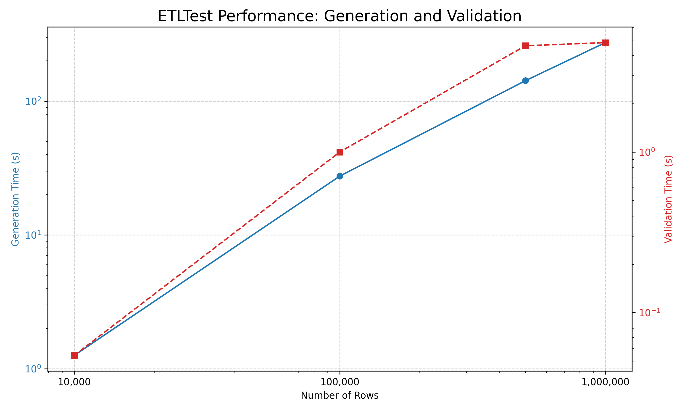

# Summary

`ETLForge` is a Python library and command-line tool designed to streamline Extract, Transform, Load (ETL) testing workflows. It provides a unified framework for generating realistic, schema-driven synthetic test data and validating ETL outputs against the same schema. By defining data structures and constraints in a single YAML or JSON file, developers and data engineers can automate the creation of test datasets and the verification of data quality, ensuring the reliability and correctness of data pipelines.

# Statement of Need

In modern data engineering, ensuring the reliability of Extract, Transform, Load (ETL) pipelines is critical. A primary challenge is maintaining data quality and integrity as data moves through complex systems [@Kimball2013]. Testing these pipelines requires high-quality, representative data, yet creating and maintaining this data is a significant bottleneck [@Redman2016]. Developers often find themselves managing two separate, disconnected processes: generating synthetic data for testing and writing validation rules to check pipeline outputs.

While powerful libraries exist for data generation (e.g., `Faker` [@Faker2024]) and data validation (e.g., `Great Expectations` [@GreatExpectations2023], `Pandera` [@Pandera2023]), they operate independently. This separation forces developers to define and maintain data schemas and business rules in multiple places, leading to code duplication, synchronization errors, and incomplete testing. A validation rule may be updated without a corresponding change to the data generator, or vice-versa, creating a gap where bugs can go undetected.

`ETLForge` is designed to solve this specific problem by unifying data generation and validation under a single, declarative schema. By providing a single source of truth (a YAML or JSON file), it ensures that the data used for testing and the rules for validation are always perfectly synchronized. This integrated, schema-first approach simplifies the testing workflow, reduces maintenance overhead, and significantly improves the robustness of the data quality assurance process, which is essential in CI/CD and agile development environments [@Fowler2013].

# State of the Field

The landscape of data testing tools includes powerful libraries for both synthetic data generation and data validation. For generation, `Faker` [@Faker2024] is a widely-used library for producing realistic-looking fake data, such as names, addresses, and other common types. For validation, frameworks like `Great Expectations` [@GreatExpectations2023] and `Pandera` [@Pandera2023] provide robust, declarative APIs for defining and executing data quality checks on dataframes.

While these tools are excellent in their respective domains, they are not designed to work together seamlessly out-of-the-box. A developer using `Faker` to generate data and `Pandera` to validate it would need to write and maintain separate definitions for each. For example, a rule to generate a unique integer ID between 1 and 1000 in the generator would need a corresponding `pa.Check.between(1, 1000)` and `unique=True` check in the validator.

`ETLForge` differentiates itself by unifying these two stages through a single, human-readable schema. The same YAML configuration that specifies `type: int`, `range: {min: 1, max: 1000}`, and `unique: true` is used by the `DataGenerator` to create conforming data and by the `DataValidator` to verify it. This integrated approach simplifies the overall workflow, reduces code duplication, and lowers the chance of testing gaps caused by mismatched specifications. `ETLForge` acts as a high-level orchestrator, leveraging the power of libraries like `Faker` (when available) for generation, while providing its own efficient validation layer tailored to the defined schema.

# Core functionality

## Schema-Driven Data Generation

`ETLForge` uses declarative YAML or JSON schemas to define data structure and constraints:

```yaml
fields:
  - name: customer_id
    type: int
    unique: true
    range: {min: 1, max: 100000}
  - name: name
    type: string
    nullable: false
    faker_template: name
  - name: email
    type: string
    unique: true
    faker_template: email
  - name: registration_date
    type: date
    range: {start: '2020-01-01', end: '2024-12-31'}
    format: '%Y-%m-%d'
  - name: purchase_amount
    type: float
    range: {min: 10.0, max: 5000.0}
    nullable: true
    null_rate: 0.05
  - name: customer_tier
    type: category
    values: [Bronze, Silver, Gold, Platinum]
```

This schema generates realistic customer data with proper constraints: unique customer IDs and emails, realistic names using Faker, registration dates within a specific range, optional purchase amounts with controlled null probability, and categorical customer tiers.

## Comprehensive Data Validation

The validation engine performs multi-layered checks:

- **Structural validation**: Column existence and naming
- **Type validation**: Data type conformance
- **Constraint validation**: Range limits, categorical values, uniqueness
- **Business rule validation**: Custom null value policies, date formats
- **Quality reporting**: Detailed error reports with row-level diagnostics

## Dual Interface Design

`ETLForge` provides both programmatic and command-line interfaces to support different workflow preferences:

```python
# Library usage
from etl_forge import DataGenerator, DataValidator

generator = DataGenerator('schema.yaml')
df = generator.generate_data(10000)

validator = DataValidator('schema.yaml')
result = validator.validate('pipeline_output.csv')
```

```bash
# Command-line usage
etl-forge generate --schema schema.yaml --rows 10000 --output test_data.csv
etl-forge check --input pipeline_output.csv --schema schema.yaml --report errors.csv
```

# Research applications

`ETLForge` has been designed to support several research and practical applications:

## Data Engineering Research
- **Pipeline robustness testing**: Generate edge cases and stress test scenarios
- **Performance benchmarking**: Create datasets of varying sizes and complexity
- **Algorithm validation**: Test data transformation algorithms with controlled inputs
- **Migration validation**: Verify data integrity during system migrations

## Educational Applications
- **Data engineering curriculum**: Provide students with realistic datasets for learning
- **ETL methodology teaching**: Demonstrate best practices in data validation
- **Research reproducibility**: Enable consistent dataset generation across studies

For example, researchers studying distributed data processing algorithms can use ETLForge to generate consistent test datasets with specific statistical properties, enabling fair comparisons across different algorithmic approaches while avoiding the complexities of sharing sensitive real-world data.

## Industry Applications
- **Continuous integration**: Automated testing in CI/CD pipelines
- **Compliance testing**: Validate data handling procedures meet regulatory requirements

# Implementation

`ETLForge` is implemented in Python 3.9+ using modern software engineering practices:

- **Core dependencies**: pandas [@McKinney2010] for data manipulation, NumPy [@Harris2020] for numerical operations, PyYAML [@pyyaml] for schema parsing, and Click [@click2022] for the CLI.
- **Optional integrations**: Faker [@Faker2024] for realistic data generation, openpyxl for Excel support
- **Architecture**: Modular design with separate generator and validator components
- **Testing**: Comprehensive test suite with 54 unit tests achieving high coverage
- **Documentation**: Extensive user guide with examples and API documentation

The framework follows Python packaging standards and is installable via pip, making it accessible to the broader Python data science ecosystem. With only 6 core dependencies, ETLForge integrates seamlessly into CI/CD pipelines with reasonable startup times.

# Performance

To validate the framework's scalability, we performed a benchmark on a standard developer machine (Windows 10, Intel i7, 32 GB RAM) using the `benchmark.py` and `plot_benchmark.py` scripts included in the repository. The benchmark measures the time to generate and subsequently validate datasets of increasing size. The results, shown below, demonstrate that `ETLForge` scales in a near-linear fashion for both core operations (note the log-log scale of the plot).



Full details on the benchmarking methodology and environment are available in `BENCHMARKS.md`. This performance makes the framework suitable for both rapid development testing and large-scale data validation scenarios.

# Comparison with existing tools

The following table compares `ETLForge` with existing tools in the data validation and generation ecosystem:

| Feature | ETLForge | Faker [@Faker2024] | Great Expectations [@GreatExpectations2023] | pandera [@Pandera2023] |
|---|---|---|---|---|
| **Schema-Driven Generation** | Full support via YAML/JSON | Manual per-field | Not supported | Manual Python code |
| **Integrated Validation** | Built-in with shared schema | Not supported | Comprehensive | Full Python validation |
| **Unified Gen/Validate Schema** | Single source of truth | Separate tooling required | Separate schemas | No generation |
| **Setup Complexity** | Single config file | Minimal | Multi-file configuration | Medium |
| **Dependency Weight** | 6 core dependencies | Lightweight | Heavy (>50) | Moderate |
| **CLI Interface** | Full-featured | Basic | Web-based + CLI | Python-only |
| **Export Formats** | CSV, Excel | Multiple | Various | DataFrame-focused |

`ETLForge` uniquely combines generation and validation in a single, lightweight framework specifically designed for ETL testing workflows. While other tools excel in their specific domains—`Faker` for realistic data generation, `Great Expectations` for enterprise-grade validation, and `pandera` for Python-native validation—none provide the integrated, schema-first approach that `ETLForge` offers for ETL pipeline testing.

# Future development

Planned enhancements include:

- **Advanced constraints**: Support for inter-column dependencies and complex business rules
- **Format expansion**: JSON, Parquet, and database connectivity
- **Integration ecosystem**: Plugins for popular ETL tools (Apache Airflow, dbt, etc.)
- **Performance optimization**: Parallel processing and memory optimization for very large datasets
- **Machine learning integration**: Statistical profiling and ML-based synthetic data generation

# Conclusion

`ETLForge` provides a comprehensive, open-source solution for synthetic test data generation and ETL pipeline validation. By combining schema-driven data generation with automated validation in a single framework, it addresses key challenges in modern data engineering workflows. The tool's design prioritizes ease of use, integration with existing workflows, and extensibility, making it valuable for both research and industry applications.

The framework's open-source nature and comprehensive documentation lower the barrier to entry for robust ETL testing practices, potentially improving data quality and pipeline reliability across the data engineering community.

# Acknowledgements

I acknowledge contributions from the open-source community, whose feedback and suggestions have been invaluable. 